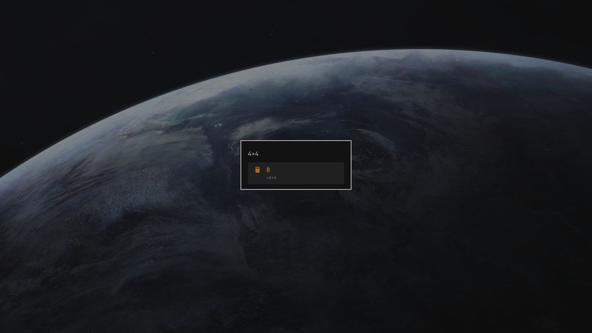

# Omarchy Menu Calculator Plugin

Type a calculation into the Omarchy menu and the answer appears as the top row.
`Enter` copies it to the clipboard.



Everything else about the menu stays exactly as Omarchy ships it. Anything that
is not arithmetic — including a bare number like `42` — leaves the search
results untouched, so `theme`, app names, and every existing route still behave
the way you expect:


## Install

```bash
omarchy plugin add https://github.com/koenhendriks/omarchy-menu-calculator-plugin.git --enable --yes
```

That clones the plugin to
`~/.config/omarchy/plugins/io.github.koenhendriks.menu-calculator/` and enables
it. Nothing else on your system is touched: no config file is rewritten, no
keybinding is changed, and no file outside that directory is created.

Enabling the plugin makes it stand in for the built-in `omarchy.menu`, so the
`SUPER` keybind, the Omarchy button on the bar, `omarchy menu`, and every script
that summons the menu all reach it automatically — there is nothing to rebind.

Update later with `omarchy plugin update io.github.koenhendriks.menu-calculator`.

## Remove

```bash
omarchy plugin disable io.github.koenhendriks.menu-calculator
```

Disabling restores the built-in Omarchy menu and puts its bar button back where
it was. To delete the files as well:

```bash
omarchy plugin remove io.github.koenhendriks.menu-calculator --yes
```

## Usage

Open the menu (`SUPER`), type an expression, read the answer. `Enter` copies the
result and sends a notification confirming it; `Escape` closes the menu as usual.


| Type this | Get this |
|---|---|
| `4+4`, `10-3`, `6*7`, `10/4` | `8`, `7`, `42`, `2.5` |
| `1250*1.21` | `1512.5` |
| `2^10`, `2**8` | `1024`, `256` |
| `(2+3)*4` | `20` |
| `10%3` | `1` — a `%` with an operand after it is a remainder |
| `20%`, `50%*2` | `0.2`, `1` — a `%` with nothing after it is a percentage |
| `sqrt(144)+2^5` | `44` |
| `round(2.5)`, `min(3,9,2)` | `3`, `2` |
| `pi*2`, `ln(e)` | `6.28318530718`, `1` |
| `0x1f+1`, `0b1010*2`, `1e3+1` | `32`, `20`, `1001` |
| `2×3`, `10÷4` | `6`, `2.5` |

**Operators** `+` `-` `*` `/` `%` `^` (or `**`), parentheses, unary minus, and
the `×` `÷` `−` `·` symbols a calculator app puts on its keys.

**Functions** `abs` `acos` `asin` `atan` `atan2` `cbrt` `ceil` `cos` `exp`
`floor` `hypot` `ln` `log` `log2` `log10` `max` `min` `mod` `pow` `round` `sign`
`sin` `sqrt` `tan` `trunc`.

**Constants** `pi`, `π`, `tau`, `e`.

**Numbers** decimals, exponents (`1e3`), hex (`0x1f`), binary (`0b1010`), and
octal (`0o17`). Commas separate function arguments, so `min(1,2)` works but
`1,000+5` does not.

Results carry twelve significant digits, which is enough that `0.1+0.2` reads as
`0.3`. Anything that is not a finite number — `1/0`, `1e309*2` — produces no row
at all rather than a row saying `Infinity`.

## How it works

`Calculator.js` is a hand-written tokenizer and precedence-climbing parser, not
`eval()`. The string comes straight out of a text field, and a parser that only
knows numbers and math cannot be talked into running anything else.

`Menu.qml` is not a fork of the Omarchy menu. It instantiates the stock menu
from `$OMARCHY_PATH/shell/plugins/menu/Menu.qml` and adds three things to it:

- a watcher on the search text that injects a calculator row into the menu's
  item tree, the same way the built-in apps provider injects applications
- an item `order` far below every real row, which is what keeps the answer on top
- an override of `parentPathFor()`, so the row's second line shows the
  expression instead of the menu path a synthetic row hasn't got

Because the row is a real menu item, search, keyboard, pointer, and theming all
treat it like any other row. The calculator stays out of `dmenu` mode
(`omarchy-menu-select`) entirely — those rows belong to whoever opened the list.

## Requirements

Omarchy 4 (Quattro) with the Quickshell-based `omarchy-shell`. The plugin uses
only commands Omarchy already ships (`omarchy-clipboard-paste-text` for the
clipboard, `omarchy-notification-send` for the confirmation); there are no
external dependencies to install.

One caveat: the import of the stock menu is a literal
`file:///usr/share/omarchy/shell/plugins/menu`, because a QML import path cannot
be built from an environment variable at runtime. That is the packaged
`$OMARCHY_PATH`. An Omarchy installed somewhere else needs that line changed in
`Menu.qml` and `BarWidget.qml`.

## Hacking on it

Saving a file under `~/.config/omarchy/plugins/` reloads plugin code
automatically. If the plugin directory is a symlink to a checkout elsewhere the
shell's file watcher will not see the change, so reload by hand:

```bash
omarchy restart shell
```

QML errors land in the shell log:

```bash
quickshell log --pid "$(pgrep -f 'quickshell -n -p /usr/share/omarchy/shell')" -t 40
```

## License

[MIT](LICENSE). Plugins run unsandboxed inside `omarchy-shell`; read the code
before you enable it — it is four short files.
